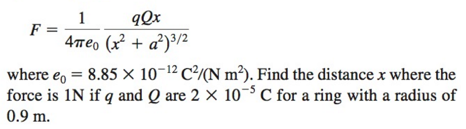

# Lab 3
The Newton-Raphson, Bisection and Secant method for solving approximate roots problem within the error limit

### About
```
1. Using Newton-Raphson method to solve(less than 0.01% error): 
```

```
2. Using (a) the Bisection method and (b) the Secant method to solve(less than 0.01% error): 
f(x) = 230x4 + 18x3 + 9x2 - 221x -9
```

### Requirements
- Features:
```
Compute given formula using different methods.
The relative approximate error should be less than 0.01%.
```
- Inputs:
```
For 1: initial value for x.
For 2: lower limit and upper limit number, first init value x_1 and second init value x_2
```
- Outputs:
```
For 1: iteration times, approximate value root and error
For 2: iteration times, approximate value root and error
